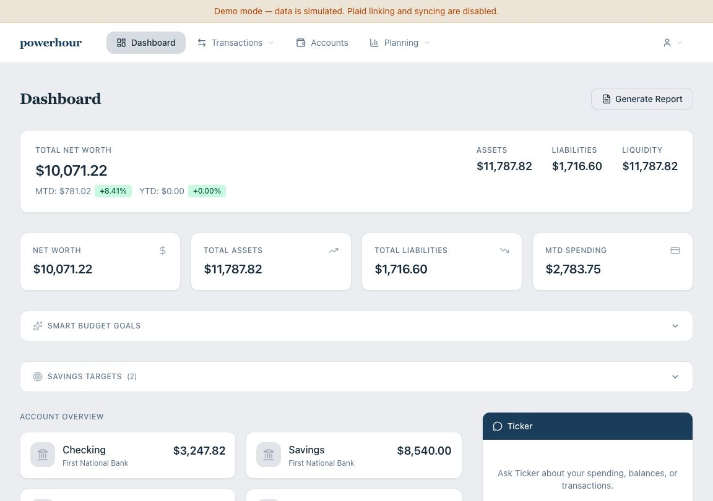
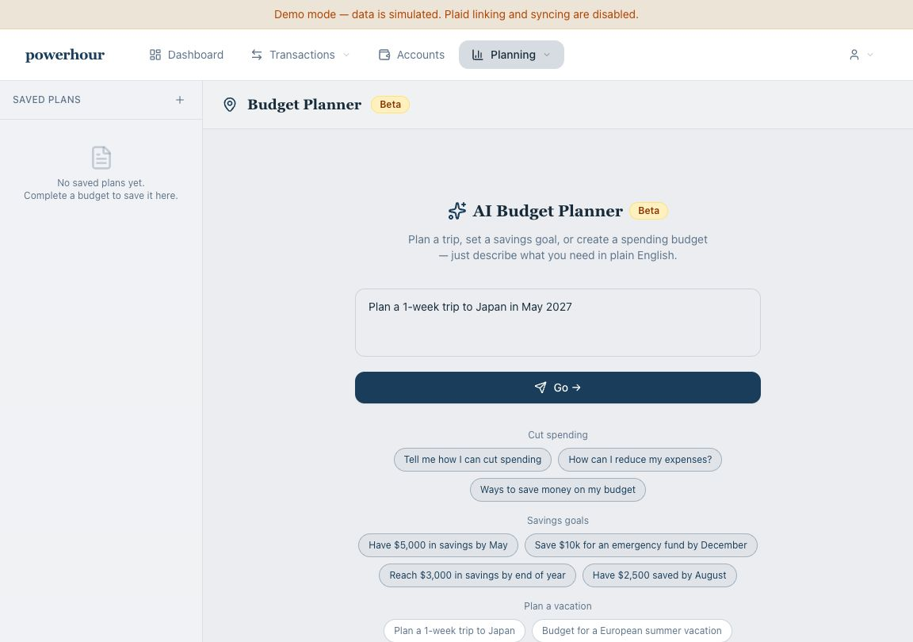
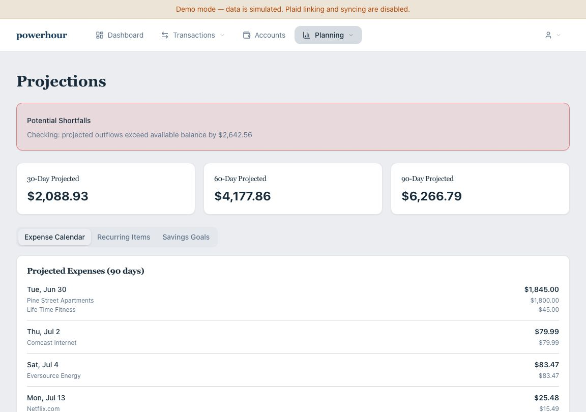
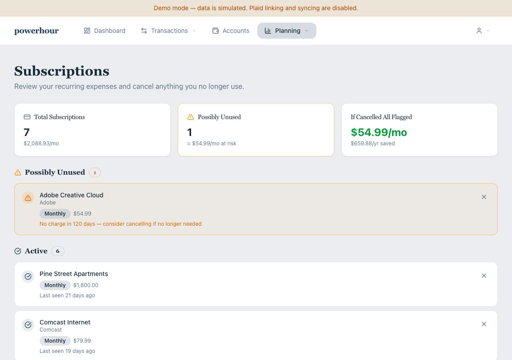

# powerhour marketing site

Standalone marketing/promo website for Powerhour.

## Why separate

This site is intentionally isolated from the authenticated app deployment so the product repo can be open sourced without coupling runtime secrets or internal routes to marketing pages.

## Design parity with main app

This marketing app uses the same visual foundation as the main app:

- Same PP Mori + PP Kyoto font files
- Same palette tokens and radius/shadow system
- Same theme preference behavior (`powerhour-theme` localStorage key)

## Screenshot preview

The homepage now uses these product screenshots from the Powerhour demo build.

| Dashboard | AI Budget Planner |
|---|---|
|  |  |

| Projections | Subscription audit |
|---|---|
|  |  |

## Local development

```bash
cd marketing-site
npm install
npm run dev
```

Open [http://localhost:3000](http://localhost:3000).

## Build and deploy

```bash
cd marketing-site
npm run build
npm run start
```

Deploy to any Next.js-compatible platform as a standalone project.

## Configuration

- `NEXT_PUBLIC_GITHUB_URL` (optional): Overrides the default GitHub CTA URL.

## Quality checks

The repository runs strict type checks, unit/component tests, cross-browser acceptance tests, automated accessibility scans, and visual-regression tests. See [testing guidance](./docs/testing.md) for local commands and the snapshot-review workflow.

## Font licensing

This project includes PP Mori and PP Kyoto font files. Redistribution and deployment usage must comply with Pangram Pangram licensing terms.
